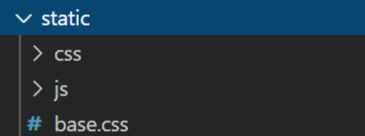
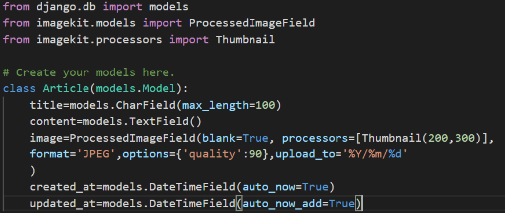

# Django Static & Media

> 2020.09.26


## 1. Static

> 웹 사이트에서 사용하는 JavaScript, CSS, Image 파일들은 django에서 Static 파일이라 부른다. 자주 쓰이는 Static 파일들을 체계적으로 관리하려는 목적으로 Django 프로젝트 폴더 내에 static 폴더를 만들어 static 파일들을 담아 관리한다.

- 사용자의 요청에 따라 내용이 바뀌는 것이 아니라 요청한 것을 그대로 내어 주면 되는 파일
- Django는 기본적으로 static 폴더 위치를 `app_name/static/`으로 알고 있다.


### 1.1 Static 파일 경로설정 & load

> Static 폴더에 파일들을 넣고 사용하려면 Django 시스템에서 Static 파일들을 참조할 수 있도록 경로를 설정해주어야 한다.

-  `settings.py`에서 static 파일 경로를 나타내는 `STATICFILES_DIRS`변수를 사용하여 static 파일의 경로를 설정한다.


- 프로젝트 폴더 바로 아래 statci 폴더를 만들어 css,js 파일들을 담아두었다.



- `base.html`폴더에서 link tag를 사용하여 static 폴더에 위치한 css파일을 불러온다.

```html
 # --> static module을 해당 html에서 사용할 수 있도록 load 함
<head>
    <link rel="stylesheet" href="">
    # 경로를 위와 같이 설정하면 static/css/bootstrap.css를 참조한다.
    # static 모듈이 static/css/bootstrap.css라는 url을 만들어
  	# 해당 url에 bootstrap.css를 문자열로 보여주도록 한다.
    # static 파일을 불러온 html파일은 bootstrap.css를 stylesheet로 적용한다.
</head>
```


## 2. Media

> 단순하게 프로젝트에 업로드 되는 파일을 말하며, static 폴더와는 다르게 사용자들로 하여금 업로드 된 파일들을 모아놓는 폴더이다.


### 2.1 Image Field 추가

- 프로젝트에 image 파일을 업로드 할 수 있도록 `models.py`에 만들어놓은 `Article` 모델에 imagefield를 추가한다.



- image를 처리할 때에는 image를 처리하는 패키지를 install 해야 한다. 대표적으로 Pillow,openCV 등이 있다. Pillow 패키지를 install 하여 Thumbnail 이미지를 사용할 수 있게끔 한다. 이외에도 저장할 파일 형식을 설정할 수 있는 format도 있다.
- 이미지가 저장되는 날짜에 따라 저장되는 파일을 동적으로 할당해주기 위해 `upload_to='%Y/%m/%d'` parameter를 설정한다.
- `models.py`를 변경하고 변경된 모델을 db에 새롭게 적용시키기 위해 다시 migration 해야한다. (단, `ProcessedImageField() 내부에 있는 parameter를 변경한 후에는 makemigrations 해줄 필요는 없다.)

```bash
$ pip install Pillow
$ python manage.py makemigrations
$ python manage.py migrate
```


- **Null / Blank **
  - Null :  DB와 관련되어 있는 옵션으로 주어진 필드가 Null을 가질 것인지를 결정한다.
  - Blank : 데이터의 유효성과 관련되어 있는 옵션으로 `form.is_valid()`가 호출될 때 폼 유효성 검사에 사용된다. 
  - 단, 문자열 기반 필드 (`CharField()`, `TextField()`)에서는 null=True를 사용하면 안된다.
  - `BooleanField`에서 Null값을 사용하고 싶으면 widget으로 `NullBooleanSelect`를 사용한다.


### 2.2 image create

- image 파일을 받으려면 form 태그에서 추가로 `enctype(인코딩 타입)`메서드 설정이 필요하다.
- `enctype="multipart/form-data"` 메서드를 추가해야 한다. image file 업로드 시에 반드시 사용해야 한다.


### 2.3 Media in settiengs

- static 파일과 같이 media파일들을 저장할 폴더를 생성하고 해당 디렉토리의 경로를 설정해주어야 한다.
- `STATIC_URL`과 동일하게 업로드 된 미디어 파일의 URL을 만들어 주는 역할을 하는 `MEDIA_URL='media/'` 를 `settings.py`에 선언해준다.
- 미디어 파일들을 저장해 놓을 디렉토리에 관한 경로를 제공하는 역할을 하는 `MEDIA_ROOT= BASE_DIR / 'media'`를 `settings.py`에 선언해준다.


### 2.4 Media in urls

- 미디어 파일을 프로젝트 내부에 업로드 시켰지만, 이를 사용자들에게 보여주기 위해서는 image별로 url을 만들어줘야 한다. 이는 `app_name.image.url`을 통해 불러온다.
- 이 url을 만들어 주는 코드는 `urlpatterns=[]+ static(settings.MEDIA_URL, document_root=MEDIA_ROOT)`이다.
- urls.py in project(not app)

